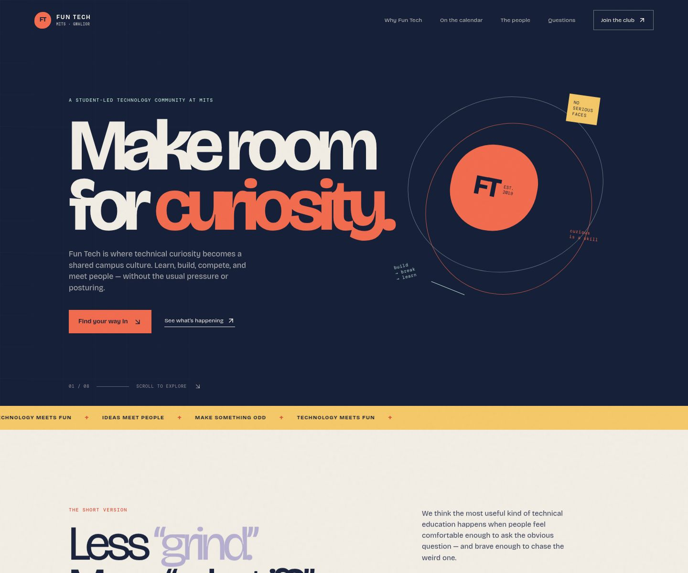
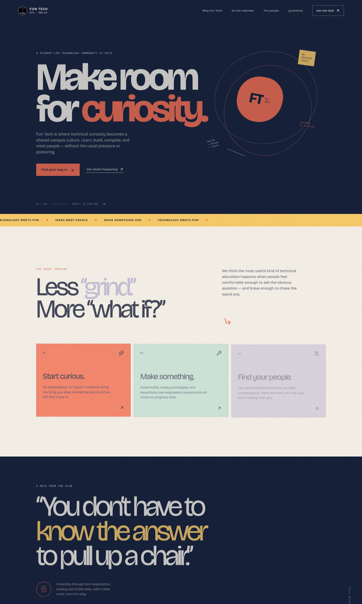
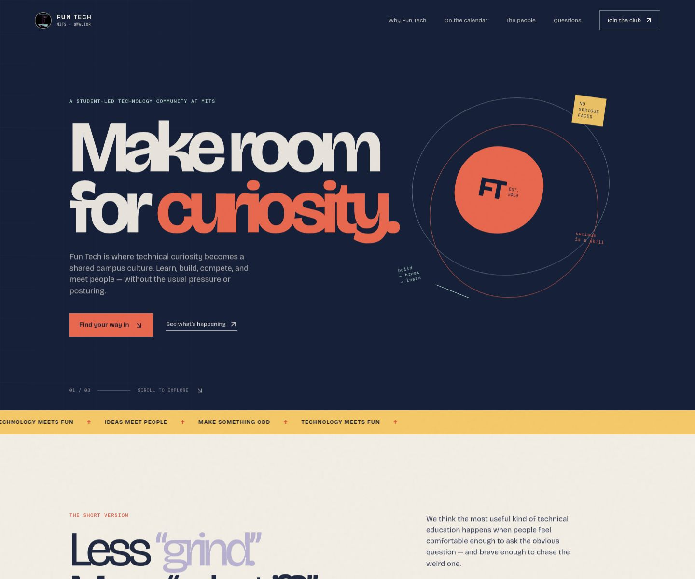

<div align="center">

# FUN TECH CLUB · MITS GWALIOR
### *Make room for curiosity — Less “grind.” More “what if?”*

[](https://react.dev/)
[](https://vitejs.dev/)
[](https://www.typescriptlang.org/)
[](https://tailwindcss.com/)
[](https://github.com/huntwter)

<br />

> **“You don’t have to know the answer to pull up a chair.”**  
> Fun Tech is where technical curiosity becomes a shared campus culture at **Madhav Institute of Technology & Science (MITS), Gwalior**. Learn, build, compete, and connect — without pressure or posturing.

<br />



</div>

---

## Design System & Color Architecture

Inspired by mid-century editorial broadsheets, tactile risograph printing, and playful campus zines, the Fun Tech Club visual identity trades generic tech templates for organic paper tones, sharp typography, and punchy accent colors.

| Design Token | Hex Code | Purpose |
| :--- | :--- | :--- |
| **`--paper`** | `#F2EEE5` | Primary background, tactile paper texture |
| **`--paper-deep`** | `#E5DFD1` | Secondary section fills, calendar backdrop |
| **`--ink`** | `#172039` | Primary typography, deep structural borders |
| **`--coral`** | `#F36D50` | Primary brand accent, curiosity pill, CTA highlights |
| **`--mint`** | `#B9DDD1` | Workshop tags, build signals, positive states |
| **`--yellow`** | `#F5C969` | Highlighted text, interactive badges, hover pops |
| **`--lavender`** | `#B6AFD0` | Community badges, subtle structural borders |

---

## The Core Pillars

<table width="100%">
  <tr>
    <td width="33%" valign="top" style="background-color: #f36d50; color: #172039; padding: 20px; border: 1px solid #172039;">
      <h3>01. Start curious.</h3>
      <p>No gatekeeping, no “expert” costume. Bring the problem you keep wondering about and we’ll find a way in together.</p>
    </td>
    <td width="33%" valign="top" style="background-color: #b9ddd1; color: #172039; padding: 20px; border: 1px solid #172039;">
      <h3>02. Make something.</h3>
      <p>Small builds, messy prototypes, and beautifully over-engineered experiments all count as genuine progress here.</p>
    </td>
    <td width="33%" valign="top" style="background-color: #b6afd0; color: #172039; padding: 20px; border: 1px solid #172039;">
      <h3>03. Find your people.</h3>
      <p>The best technical shortcuts are conversations. Meet the peer builders who will stay late to debug with you.</p>
    </td>
  </tr>
</table>

---

## Interactive Architecture & Features

### 1. Calendar & Event Actions
- **Google Calendar Sync**: Single-click links pre-filled with event title, date, venue (LT-2, MITS), schedule, and workshop agendas.
- **iCalendar (.ICS) Export**: Generates and downloads native calendar invites for Apple Calendar, Microsoft Outlook, and mobile devices.
- **Seat Reservations**: Instant RSVP button that anchors directly to the registration section with pre-filled event selection.
- **Event Bookmarking**: Interactive local bookmarking toggles with immediate feedback notifications.

### 2. Comprehensive Club Application & RSVP Form
- **Multi-Track Mode**: Toggle between full Club Membership and quick Event RSVP.
- **Curiosity Chips**: Interactive skill selectors covering Web & App Dev, AI/ML, Robotics & Hardware, UI/UX, Open Source, and Competitive Coding.
- **Department & Year Selectors**: Configured for all MITS branches (CSE, IT, AI-DS, ECE, EE, Mechanical, Civil).
- **Digital Member Pass Generator**: Generates an official confirmation pass with a custom Member ID (FT-MITS-24-XXXX), RSVP summary, and calendar invite links.

### 3. High-Resolution Poster Lightbox
- Click any workshop poster or campus archive photo to open a full-resolution modal.
- Includes quick-action triggers to download calendar events or view full uncropped assets.

---

## Visual Showcase

<div align="center">
  
  
  <br />
  
  
</div>

---

## Technology Stack

```text
Frontend Framework  : React 19 (Hooks, Concurrent Rendering)
Build Tool          : Vite 7 (Hot Module Replacement, ESNext)
Language            : TypeScript 5.9 (Strict Type Safety)
Styling Engine      : TailwindCSS v4 + Custom Design System
Iconography         : Lucide React
Notifications       : Sonner
Typography          : Bricolage Grotesque & DM Mono (Google Fonts)
```

---

## Quick Start & Local Setup

```bash
# 1. Clone the repository
git clone https://github.com/huntwter/funtech-club-.git

# 2. Navigate to the project directory
cd funtech-club-

# 3. Install dependencies
npm run install-deps

# 4. Start the Vite development server
npm run dev
```

Visit `http://localhost:5173` in your browser.

### Building for Production

```bash
# Create optimized production build
npm run build

# Preview production build locally
npm run preview
```

---

## Faculty Coordinators & Guidance

- **Dr. Tej Singh** — Assistant Professor, MITS Gwalior (Faculty Coordinator)
- **Dr. Priyanka Garg** — Assistant Professor, MITS Gwalior (Faculty Coordinator)

---

## Contact & Community

- **Instagram**: [@funtech_club.mits](https://www.instagram.com/funtech_club.mits)
- **Email**: [funtech@mitsgwalior.in](mailto:funtech@mitsgwalior.in)
- **Campus**: Madhav Institute of Technology & Science (MITS), Gwalior, MP, India

---

<div align="center">

### Made by **Jatin Sharma** for fun With heart

© 2026 Made by Jatin Sharma

</div>
